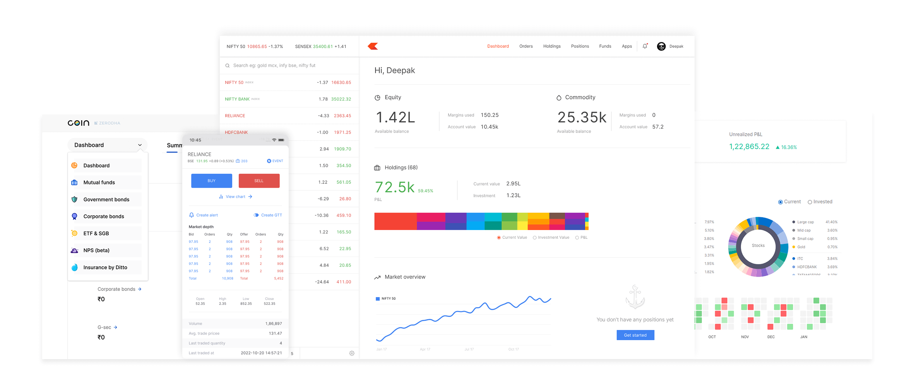

# Zerodha Clone 📈

A full-stack stock trading platform clone built with the MERN Stack, replicating core features of Zerodha — India's largest stock broker.


---

## 🛠️ Tech Stack

| Layer | Technology |
|---|---|
| Frontend | React.js, Bootstrap, CSS |
| Backend | Node.js, Express.js |
| Database | MongoDB Atlas, Mongoose |
| Authentication | JWT, Bcrypt |

---

## ✨ Features

- 🔐 User Authentication (Signup / Login with JWT)
- 📊 Live Dashboard with Holdings & Positions
- 📋 Orders Management
- 💰 Funds Overview
- 📈 Stock Watchlist
- 📱 Responsive Design
- 🔒 Secure Password Hashing with Bcrypt

---

## 📁 Project Structure


Start backend:
```bash
node index.js
```

### Frontend Setup
```bash
cd frontend
npm install
npm start
```

Frontend runs on → `http://localhost:3000`

### Dashboard Setup
```bash
cd dashboard
npm install
npm start
```

Dashboard runs on → `http://localhost:3001`

---

## 🔑 Environment Variables

| Variable | Description |
|---|---|
| `MONGO_URL` | MongoDB Atlas connection string |
| `JWT_SECRET` | Secret key for JWT token |
| `PORT` | Backend server port (default: 3002) |

---

## 📡 API Endpoints

| Method | Endpoint | Description |
|---|---|---|
| POST | `/signup` | Register new user |
| POST | `/login` | Login existing user |
| GET | `/allHoldings` | Get all holdings |
| GET | `/allPositions` | Get all positions |
| POST | `/newOrder` | Place new order |

---

## 📸 Screenshots

### Landing Page


### Dashboard


---


## 👨‍💻 Author

**Abhishek Kumar Singh**
- 🎓 B.Tech CSE — BIET Lucknow (2026)
- 💼 Training— HCL Technologies
- 🔗 GitHub: [@abhi17181](https://github.com/abhi17181)
- 📧 Email: as7651173@gmail.com
- 🔗 LinkedIn: [https://www.linkedin.com/in/abhishekksingh18/]

---

## 📄 License

This project is for educational purposes only.
Zerodha is a trademark of Zerodha Broking Ltd.

---

⭐ If you found this project helpful, please give it a star!
